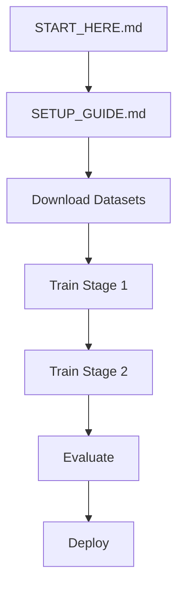

# 📑 SemRoCL Project Index

Quick navigation guide for the SemRoCL project.

## 🎯 Getting Started

| File | Purpose | Priority |
|------|---------|----------|
| **[START_HERE.md](START_HERE.md)** | Quick start guide | ⭐⭐⭐ START HERE! |
| **[SETUP_GUIDE.md](SETUP_GUIDE.md)** | Detailed setup instructions | ⭐⭐⭐ |
| **[README.md](README.md)** | Full project documentation | ⭐⭐ |

## 📚 Documentation

| File | Content | When to Read |
|------|---------|--------------|
| **[PROJECT_STRUCTURE.txt](PROJECT_STRUCTURE.txt)** | Complete project structure | Understanding architecture |
| **[MANIFEST.txt](MANIFEST.txt)** | File inventory & statistics | Exploring the codebase |
| **[docs/README_Research.md](docs/README_Research.md)** | Research overview | Planning experiments |
| **[docs/Research_Plan.docx](docs/Research_Plan.docx)** | 18-month research plan | Understanding methodology |

## 💻 Source Code

### Core Modules
| File | Description |
|------|-------------|
| **[src/data_loader.py](src/data_loader.py)** | Dataset loading (paired/unpaired) |
| **[src/utils.py](src/utils.py)** | Helper functions |
| **[src/loss_functions.py](src/loss_functions.py)** | All loss implementations |

### Model Components
| File | Description |
|------|-------------|
| **[src/model/encoder_moco.py](src/model/encoder_moco.py)** | MoCo v3 contrastive encoder |
| **[src/model/semantic_head.py](src/model/semantic_head.py)** | SegFormer-B0 + uncertainty |
| **[src/model/enhancer.py](src/model/enhancer.py)** | Curve-based enhancer |
| **[src/model/discriminator.py](src/model/discriminator.py)** | PatchGAN discriminator |

### Training & Evaluation
| File | Description |
|------|-------------|
| **[src/train_stage1_moco.py](src/train_stage1_moco.py)** | Stage 1: MoCo pretraining |
| **[src/train_stage2_enhance.py](src/train_stage2_enhance.py)** | Stage 2: Enhancement training |
| **[src/evaluate.py](src/evaluate.py)** | Evaluation with metrics |

## ⚙️ Configuration

| File | Purpose |
|------|---------|
| **[configs/train_stage1.yaml](configs/train_stage1.yaml)** | MoCo pretraining config |
| **[configs/train_stage2.yaml](configs/train_stage2.yaml)** | Enhancement config |
| **[configs/model_config.yaml](configs/model_config.yaml)** | Model architecture config |

## 🗂️ Data

| Location | Content |
|----------|---------|
| **[data/README.md](data/README.md)** | Dataset documentation |
| **data/LIME/** | LIME dataset (to be filled) |
| **data/LOL-v1/** | LOL-v1 dataset (to be filled) |
| **data/LOL-v2/** | LOL-v2 dataset (to be filled) |

## 📦 Environment

| File | Purpose |
|------|---------|
| **[environment.yml](environment.yml)** | Conda environment |
| **[requirements.txt](requirements.txt)** | pip requirements |

## 🎓 Workflow

## 📞 Quick Links

- **Installation**: [SETUP_GUIDE.md](SETUP_GUIDE.md#installation)
- **Training**: [SETUP_GUIDE.md](SETUP_GUIDE.md#training-pipeline)
- **Evaluation**: [README.md](README.md#evaluation)
- **Troubleshooting**: [SETUP_GUIDE.md](SETUP_GUIDE.md#troubleshooting)
- **Research Plan**: [docs/Research_Plan.docx](docs/Research_Plan.docx)

## 🔍 Search Guide

Looking for something specific?

- **Dataset loading** → `src/data_loader.py`
- **Loss functions** → `src/loss_functions.py`
- **Training loops** → `src/train_stage1_moco.py`, `src/train_stage2_enhance.py`
- **Model architectures** → `src/model/`
- **Configuration** → `configs/`
- **Metrics** → `src/evaluate.py`

---

**Last Updated**: October 2025  
**Version**: 1.0.0  
**Status**: ✅ Complete
